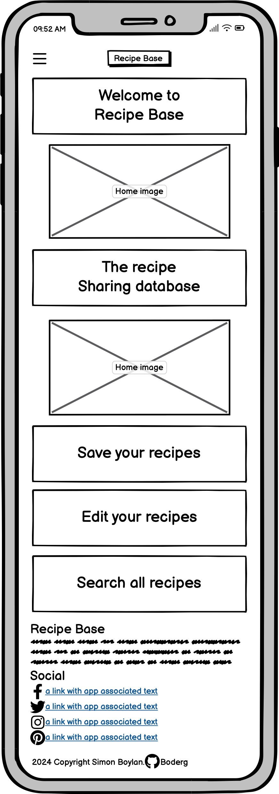
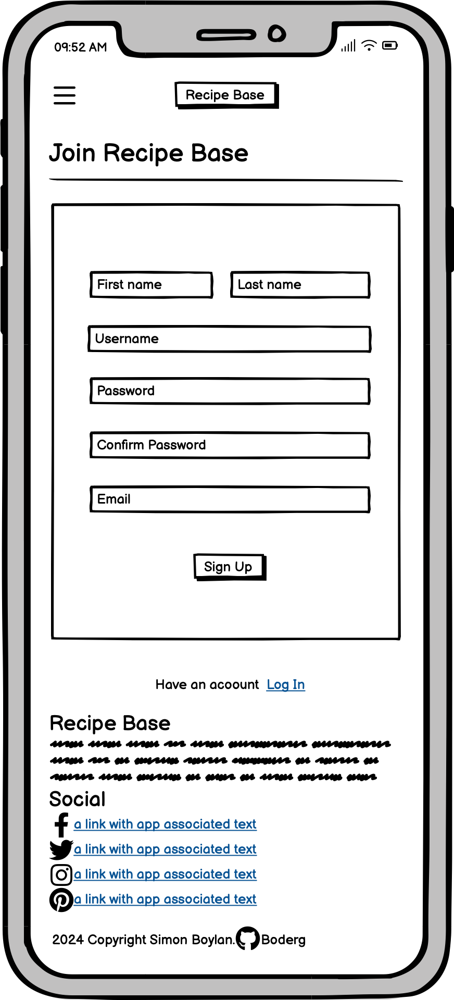
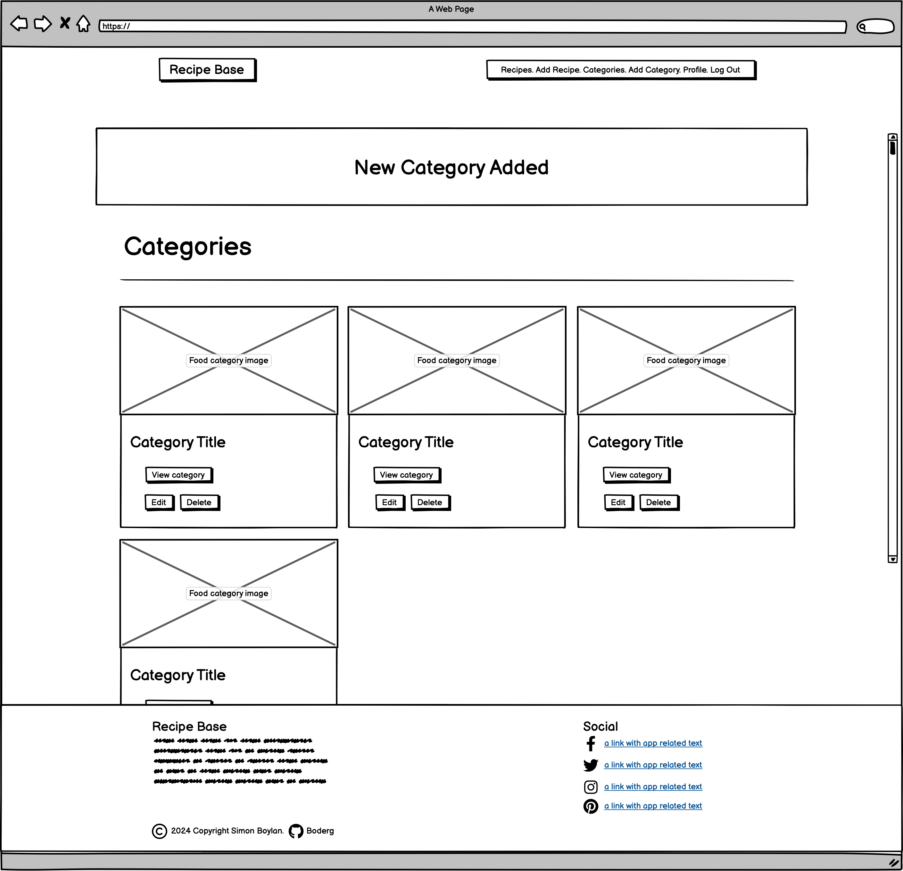
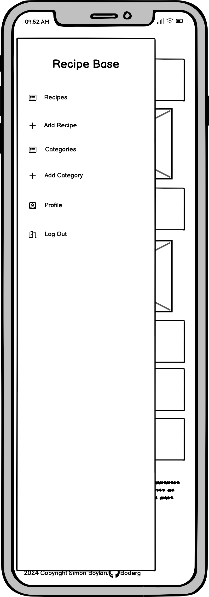
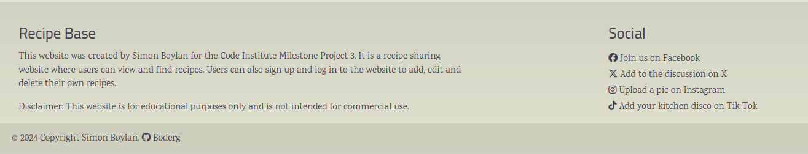

# [RECIPE BASE](https://boderg-recipe-base-6a6e035e0009.herokuapp.com "Click to view the deployed site")

- Recipe Base is a recipe sharing database where users can add their recipes, view, edit and delete their recipes.
- Recipe Base is for anyone who wants an online space to save their recipes instead of cluttering up their kitchen with lots of books or bits of paper stuffed in folders.
- Recipe Base is for anyone who wishes to share their recipes with others.
- Recipe Base is for anyone who wants to find new and exciting recipes saved by others.
- All recipes on the site can be categorised and searched for by category or by ingredient.
- All recipes can be viewed by anyone, however, you must be logged in as a signed up user to view the full recipe with instructions.
- Signed in users can only edit their own recipes and profiles, so users can be sure their recipes won't be deleted by others.
- Non registered users are restricted to only ingredients for recipes and have no access to full recipes, categories or profiles.

## Mockup Screenshot

Here is a mockup of the Recipe Base site using the Am I Responsive website.

| Mockup |
| :---: |
|  |

## UX

Here is the process behind the design of the Recipe Base site.

- The design for Recipe Base started as a series of wireframes covering mobile, tablet and desktop formats to determine the initial design and layout of the site.
- User stories were created to determine how a user might want to interact with the site.
- A flowchart and database ERD were then designed to work out the flow of the site.
- Recipe Base was designed with registered users in mind offering a safe storage of their saved recipes.
- A classy look and feel was given to the site to help it stand out but also be easy on the eye.

### Colour Scheme

The colours chosen for the site where as follows;

- `#e7e9bb and #403b4a` used for main body background, border and button gradients.
- `#f8ebff and #80c3b2` used for cards and panel background gradients.
- `#403b4a` used for main text and icons.
- `#0076662` used for text hover.
- `#e7e9bb` used for icon hover.
- `#ffffff` used for button text,
- `#333333` used for button text shadows.
- `#ff0000` used for delete button text.

[cssgradient.io](https://cssgradient.io/gradient-backgrounds/) was used for colour and gradient choices.

- cssgradient.io was used to style the buttons on the Recipe Base site. The gradient chosen gives a kind of metallic look to the buttons.
- The colours used for the buttons were translated to the borders and gradients on the Recipe Base site.
- The remaining colours were then chosen by eye to fit with the aesthetic of the site as they worked well with the borders and button colours.

Here are screenshots of the button choice that influenced the colour direction of the Recipe Base site.

| Button chosen | Button site |
| :---: | :---: |
|  |  |

CSS `:root` variables were used to easily update the global colour scheme by changing only one value, instead of everywhere in the CSS file.

```css
:root {
    --transparent: #00000000;
    --white: #ffffffff;
    --text-main: #403b4aff;
    --text-hover: #007662ff;
    --sidenav-hover-bg: #00000033;
    --icons: #403b4a;
    --icons-hover: #e7e9bb;
    --input-active: #f8ebff;
    --footer: #00000014;
    --modal-footer: #80c3b277;
    --delete: #ff0000;
    --body-gradient: linear-gradient(to top, #e7e9bb77, #403b4a77 100%);
    --card-reveal: linear-gradient( #f8ebff 10%, #80c3b2 100%);
    --card-panel: linear-gradient( #f8ebff 10%, #80c3b2 100%) padding-box,
                linear-gradient(135deg, #e7e9bb 10%, #403b4a 100%) border-box;
    --border-gradient: linear-gradient(var(--white), var(--white)) padding-box,
                linear-gradient(135deg, #e7e9bb 10%, #403b4a 100%) border-box;
    --button-gradient: linear-gradient(135deg, #403b4a 0%, #e7e9bb  51%, #403b4a  100%);
}
```

### Typography

Fontjoy was used for font pairing and selection for the Recipe Base site.

| Light background | Dark background |
| :---: | :---: |
|  |  |

Here are screenshots of the font selection:

Three fonts were decided upon and implemented as follows:

- [Cairo](https://fonts.google.com/specimen/Cairo) was used for the primary headers, navigation and buttons.

- [Cormorant Infant](https://fonts.google.com/specimen/Cormorant-Infant) was used for all titles.

- [Karma](https://fonts.google.com/specimen/Karma) was used for all paragraphs and standard text.

- [Font Awesome](https://fontawesome.com) icons were used throughout the site, such as the social media icons in the footer, button icons and form icons.

## User Stories

Here are some of the user stories for the Recipe Base site.

### New Site Users

- As a new site user, I would like to view recipes, so that I can get some inspiration for different meals.
- As a new site user, I would like to have an option to sign up easily, so that I can actively join a community.
- As a new site user, I would like to be able to search for different ingredients , so that I can change up my mealtime variety.
- As a new site user, I would like to be able to search for recipes with similar ingredients, so that I can see variations of of a meal.
- As a new site user, I would like to see what the site is about, so that I can so that I can make an informed choice as to whether I should sign up or not.

### Returning Site Users

- As a returning site user, I would like to be able to log in, so that I can access features available to signed up users.
- As a returning site user, I would like to have a place to save my own recipes, so that I can retrieve them when I need to.
- As a returning site user, I would like to have a place to save my recipes, so that I can share my creations with others.
- As a returning site user, I would like to be able to view recipes by food type, so that I can find variations for a particular food type.
- As a returning site user, I would like to be able to edit a recipe, so that I can adjust any changes I have made to my recipe.

### Site Admin

- As a site administrator, I should be able to access the site, so that I can make changes to food categories.
- As a site administrator, I should be able to access, so that I can create new food categories.
- As a site administrator, I should be able to access the site, so that I can categorise recipes that have not been categorised by the owner, making them more easily accessible in searches.
- As a site administrator, I should be able to access the site, so that I can delete fake entries (if created).
- As a site administrator, I should be able to access the site, so that I can remove fake or malicious accounts.

## Wireframes

To follow best practice, wireframes were developed for mobile, tablet, and desktop sizes.
I've used [Balsamiq](https://balsamiq.com/wireframes) to design the Recipe Base site wireframes.

<details>
<summary>Click here to view the wireframes for the Recipe Base site.</summary>

### Home Page Wireframes

| Mobile | Tablet | Desktop |
| :---: | :---: | :---: |
|  |  |  |

### Registration Page Wireframes

| Mobile | Tablet | Desktop |
| :---: | :---: | :---: |
|  |  |  |

### Log In Page Wireframes

| Mobile | Tablet | Desktop |
| :---: | :---: | :---: |
|  |  |  |

### Recipes Page Wireframes

| Mobile | Tablet | Desktop |
| :---: | :---: | :---: |
|  |  |  |

### Recipe Page Wireframes

| Mobile | Tablet | Desktop |
| :---: | :---: | :---: |
|  |  |  |

### Categories Page Wireframes

| Mobile | Tablet | Desktop |
| :---: | :---: | :---: |
|  |  |  |

### Category Page Wireframes

| Mobile | Tablet | Desktop |
| :---: | :---: | :---: |
|  |  |  |

### Profile Page Wireframes

| Mobile | Tablet | Desktop |
| :---: | :---: | :---: |
|  |  |  |

### Add Recipe Page Wireframes

| Mobile | Tablet | Desktop |
| :---: | :---: | :---: |
|  |  |  |

### Add Category Page Wireframes

| Mobile | Tablet | Desktop |
| :---: | :---: | :---: |
|  |  |  |

### Edit Recipe Page Wireframes

| Mobile | Tablet | Desktop |
| :---: | :---: | :---: |
|  |  |  |

### Edit Category Page Wireframes

| Mobile | Tablet | Desktop |
| :---: | :---: | :---: |
|  |  |  |

### Edit Profile Page Wireframes

| Mobile | Tablet | Desktop |
| :---: | :---: | :---: |
|  |  |  |

### Flash Messages Wireframes

| Mobile | Tablet | Desktop |
| :---: | :---: | :---: |
|  |  |  |

### Delete Modal (Page Bottom) Wireframes

| Mobile | Tablet | Desktop |
| :---: | :---: | :---: |
|  |  |  |

### Side Navigation Wireframes

| Mobile | Tablet |
| :---: | :---: |
|  |  |

### Error 404 Page Wireframes

| Mobile | Tablet | Desktop |
| :---: | :---: | :---: |
|  |  |  |

### Error 500 Page Wireframes

| Mobile | Tablet | Desktop |
| :---: | :---: | :---: |
|  |  |  |

</details>

## Features

Here are features of the Recipe Base site:

### Existing Features

<details>
<summary>Click here to view existing features</summary>

| Feature Title | Feature Description | Feature Screenshot |
| :---: | :---: | :---: |
| Brand logo | This doubles as a home button and returns users to the home page.|  |
| Dynamic Navigation Bar  | This performs the navigation for the site and the nav buttons change dynamically according to what type of user is on the site. This is implemented by Jinja2 statements in the base.html file. |   |
| Feature Cards | These are dynamic links that display differently to registered and non registered users. If a non registered user is on the site they open modals and the register page prompting sign up. If a user is signed in they direct the user to the add recipe and recipes pages. This is implemented by Jinja2 statements in the home.html file. |   |
| Footer | This is where the links to social sites and my GitHub are to be found. |  |
| Search Bar | This is where registered users can search for recipes by title, ingredient or description. This uses an 'Inclusive' search type to show more results. Users can press enter or click the 'Search' button to submit a search. The 'Reset' button restores the recipes page to normal. |  |
| Recipe Cards | This where a simple view of the recipe is held. Clicking the elipsis will open the restricted quick view of a recipe. Clicking the 'Full View' button will open the full recipe which is only accessible to registered signed in users. |   |
| Recipe Page Buttons | This is where signed in users can navigate to edit or delete their own recipes. The 'Back' button goes back to the recipes page, the 'Edit' button goes to the edit recipe page and the 'Delete' button allows for deletion of the recipe via a delete modal pop up. |  |
| Add Recipe Form | This is where signed in users can add their own recipes. |  |
| Edit Recipe Form | This is where signed in users can edit a recipe they have added to the database. Lines are auto populated with the data from the recipe selected. This is implemented using Jinja2 expressions in the value fields of the inputs in the html code. |  |
| Plus / Minus Icons | These allow signed in users to add and remove input fields as they add or edit their recipes. This is implemented by two simple JavaScript functions ('addItem' and 'removeItem') in the script.js file. |   |
| Dropdown Selector | This is where signed in users can select the various food categories that their recipe might fall under. This selection choice aids with the searching of recipes. |   |
| Add Recipe Buttons | This is where signed in users submit their recipe to the database. The 'Add Recipe' button submits to the database and the 'Cancel' button returns the user back to the recipes page cancelling the add recipe function. |  |
| Edit Recipe Buttons | This is where signed in users can submit their edited recipe to the database. The 'Update Recipe' button submits the edits to the database and the 'Cancel' button returns the the user back to the recipes page cancelling the edit recipe function. |  |
| Category Cards | This is where a simple view of the food category is held. Clicking the 'View Category' button takes the user to that categories page displaying any recipes in that category as defined by the dropdown selector in the add recipes form. |  |
| Additional Category Card Features | These features are only accessible to the Recipe Base administrator. The 'Edit' button allows for editing of the category name and image and the 'Delete' button allows for deletion of the category via a delete modal pop up. The 'Updated on' allows the admin to see when the card was last updated. |  |
| Edit Category Buttons | The 'Update Category' button submits the category updates to the database. The 'Cancel' button returns the admin back to the categories page cancelling the edit category function. |  |
| Add Category | This is a navigation function only available to the Recipe Base administrator and takes the admin to add categories form page. |  |
| Add Category Form | The add category form allows the Recipe Base admin to add a new category name and image url. |  |
| Add Category Buttons | The 'Add Category' button submits the new category to the database. The 'Cancel' button returns the admin to the categories page cancelling the add category function. |  |
| Edit Profile Button | This button allows signed in users to edit their profile details by takign the user to an edit profile page.  |  |
| Edit Profile Form | This is where signed in users can edit their name, email and bio. They can also add a new url for their profile image. |  |
| Edit Profile Form Buttons | This is where the user sumbits their edits to the database. The 'Update Profile' button submits the edits to the database, the 'Cancel' button returns the user to the profile page cancelling the function and the 'Delete Profile' button allows for deletion of their profile via a delete modal pop up.  |  |
| Log Out | This is where the user can log out of the site. |  |
| Register Form | This is where the user can sign up to the site enabling them to access signed in only features. |  |
| Log In Form | This is where a signed up user can log in to their account and access signed in only features. |  |
| Sign Up Link | This allows for non registered users to quickly navigate to the Register page. |  |
| Log In Link | This allows for signed up users to quickly navigate to the Log In page. |  |
|Flash Banners| These flash up on the screen when an action ahs been performed such as on login, logout, recipe and category additions and updates and profile updates |   |

The signed in and admin user only features are all implemented with Jinja2 statements in the navigation sections of the base.html file along with the if `session.get("user"):` statements in the functions of the app.py file.

</details>

### Future Features

Some future features that would be a good addition could be:

- Profile View
  - Allow signed in users to view the profiles of of other recipe creators.
- Contact Form
  - Allow signed in users to contact site admin to make suggestions or changes to recipes, categories and profiles.
- Community Messaging
  - Add a message board for signed in users to contact each other to share tips and tricks etc.
- Rating System
  - Add a rating system so users can rate recipes and the top 3 each month will be displayed on the home page.

## Tools & Technologies Used

The following are the tools and technologies that were used in the creation of the Recipe Base site.

- [HTML](https://en.wikipedia.org/wiki/HTML) used for the main site content.
- [CSS](https://en.wikipedia.org/wiki/CSS) used for the main site design and layout.
- [CSS :root variables](https://www.w3schools.com/css/css3_variables.asp) used for reusable styles throughout the site.
- [JavaScript](https://www.javascript.com) used for user interaction on the site.
- [Python](https://www.python.org) used as the back-end programming language.
- [VSCode](https://code.visualstudio.com/) used for local IDE for development.
- [Git](https://git-scm.com) used for version control. (`git add`, `git commit`, `git push`)
- [GitHub](https://github.com) used for secure online code storage.
- [GitHub Pages](https://pages.github.com) used for hosting the deployed front-end site.
- [Materialize](https://materializecss.com) used as the front-end CSS framework for modern responsiveness and pre-built components.
- [Flask](https://flask.palletsprojects.com) used as the Python framework for the site.
- [MongoDB](https://www.mongodb.com) used as the non-relational database management with Flask.
- [Heroku](https://www.heroku.com) used for hosting the deployed back-end site.
- [Google Fonts](https://fonts.google.com/) used to search a suitable font and obtain a download link for that font.
- [Font Awesome](https://fontawesome.com/) used to add GitHub icon to the footer and modal and search icon to the search button.
- [Lucid Chart](https://www.lucidchart.com/pages/) used to create the database model and website flowchart.

## Database Design

My project uses a non-relational database with MongoDB, and therefore the database architecture
doesn't have actual relationships like a relational database would.

My database is called **recipe_base**.

It contains 3 collections:

- **users**

- **recipes**

- **categories**

These are outlined in the diagrams below:

| Database Model |
| :---: |
|  |

## Website Flow

A flowchart was created for the Recipe Base site to outline the general flow of the site and to give a graphical representation to show what is accesible to different types of user and how the site pages connect with each other.

| Website Flowchart |
| :---: |
|  |

## Testing

For all testing of Recipe Base, please refer to the [TESTING.md](TESTING.md) file.

## Deployment

The live deployed Recipe Base application can be found deployed on [Heroku](https://boderg-recipe-base-6a6e035e0009.herokuapp.com).

### MongoDB Non-Relational Database

The Recipe Base project uses [MongoDB](https://www.mongodb.com) for the Non-Relational Database.

To obtain your own MongoDB Database URI, sign-up on their site, then follow these steps:

- The name of the database on MongoDB should be called **insert-your-database-name-here**.
- The collection(s) needed for this database should be **insert-your-collection-names-here**.
- Click on the **Cluster** name created for the project.
- Click on the **Connect** button.
- Click **Connect Your Application**.
- Copy the connection string, and replace `password` with your own password (also remove the angle-brackets).

### Heroku Deployment

The Recipe Base project uses [Heroku](https://www.heroku.com), a platform as a service (PaaS) that enables developers to build, run, and operate applications entirely in the cloud.

Deployment steps are as follows, after account setup:

- Select **New** in the top-right corner of your Heroku Dashboard, and select **Create new app** from the dropdown menu.
- Your app name must be unique, and then choose a region closest to you (EU or USA), and finally, select **Create App**.
- From the new app **Settings**, click **Reveal Config Vars**, and set your environment variables.

| Key | Value |
| --- | --- |
| `DATABASE_URL` | user's own value |
| `IP` | 0.0.0.0 |
| `MONGO_DBNAME` | user's own value |
| `MONGO_URI` | user's own value |
| `PORT` | 5000 |
| `SECRET_KEY` | user's own value |

Heroku needs two additional files in order to deploy properly.

- requirements.txt
- Procfile

You can install this project's **requirements** (where applicable) using:

- `pip3 install -r requirements.txt`

If you have your own packages that have been installed, then the requirements file needs to be updated using:

- `pip3 freeze --local > requirements.txt`

The **Procfile** can be created with the following command:

- `echo web: python app.py > Procfile`
- *replace **app.py** with the name of your primary Flask app name; the one at the root-level*

For Heroku deployment, follow these steps to connect your own GitHub repository to the newly created app:

Either:

- Select **Automatic Deployment** from the Heroku app.

Or:

- In the Terminal/CLI, connect to Heroku using this command: `heroku login -i`
- Set the remote for Heroku: `heroku git:remote -a app_name` (replace *app_name* with your app name)
- After performing the standard Git `add`, `commit`, and `push` to GitHub, you can now type:
- `git push heroku main`

The project should now be connected and deployed to Heroku!

### Local Deployment

The Recipe Base project can be cloned or forked in order to make a local copy on your own system.

For either method, you will need to install any applicable packages found within the *requirements.txt* file.

- `pip3 install -r requirements.txt`.

You will need to create a new file called `env.py` at the root-level,
and include the same environment variables listed above from the Heroku deployment steps, plus a few extras.

Sample `env.py` file:

```python
import os

os.environ.setdefault("IP", "0.0.0.0")
os.environ.setdefault("MONGO_DBNAME", "user's own value")
os.environ.setdefault("MONGO_URI", "user's own value")
os.environ.setdefault("PORT", "5000")
os.environ.setdefault("SECRET_KEY", "user's own value")
```

#### Cloning

You can clone the Recipe Base repository by following these steps:

1. Go to the [Recipe Base GitHub repository](https://github.com/boderg/recipe-base)
2. Locate the Code button above the list of files and click it
3. Select if you prefer to clone using HTTPS, SSH, or GitHub CLI and click the copy button to copy the URL to your clipboard
4. Open Git shell or Terminal
5. Change the current working directory to the one where you want the cloned directory
6. In your IDE Terminal, type the following command to clone my repository:
  -`git clone https://github.com/boderg/recipe-base.git`
7. Press Enter to create your local clone.

Alternatively, if using Gitpod, you can click below to create your own workspace using this repository.

[](https://gitpod.io/#https://github.com/boderg/recipe-base)

Please note that in order to directly open the project in Gitpod, you need to have the browser extension installed.
A tutorial on how to do that can be found [here](https://www.gitpod.io/docs/configure/user-settings/browser-extension).

#### Forking

By forking the GitHub Repository, we make a copy of the original repository on our GitHub account to view and/or make changes without affecting the original owner's repository.
You can fork this repository by using the following steps:

1. Log in to GitHub and locate the [Recipe Base GitHub Repository](https://github.com/boderg/recipe-base)
2. At the top of the Repository (not top of page) just above the "Settings" Button on the menu, locate the "Fork" Button.
3. Once clicked, you should now have a copy of the original repository in your own GitHub account!

### Local VS Deployment

There are no discernable differences between the development Recipe Base site and the Heroku deployed recipe Base site.

## Credits

I would like to acknowledge all applicable content that has aided the creation of Recipe Base as outlined in the sections below.

### Content

| Source | Location | Notes |
| --- | --- | --- |
| [Markdown Builder](https://tim.2bn.dev/markdown-builder) | README and TESTING | tool to help generate the Markdown files |
| [Chris Beams](https://chris.beams.io/posts/git-commit) | version control | "How to Write a Git Commit Message" |
| [strftime](https://strftime.org) | CRUD functionality | helpful tool to format date/time from string |
| [Materialize](https://materializecss.com/navbar.html) | Base.html | sidenav functionality |
| [Materialize](https://materializecss.com/tooltips.html) | Add and Edit recipe pages | tooltip pop ups |
| [Materialize](https://materializecss.com/select.html) | Add and Edit recipe pages | dropdown selector functionality |
| [Materialize](https://materializecss.com/modals.html) | Home page and delete buttons | modal functionaity |

### Media

| Source | Location | Type | Notes |
| --- | --- | --- | --- |
| [Unsplash](https://unsplash.com/photos/gray-freestanding-range-oven-uGak0qtrphM?utm_content=creditCopyText&utm_medium=referral&utm_source=unsplash) | Recipes and Categories Pages | Photo by - Becca Tapert | Used as a placeholder image on recipe and category cards |
| [Unsplash](https://unsplash.com/photos/raw-meat-on-white-ceramic-plate-YlAmh_X_SsE?utm_content=creditCopyText&utm_medium=referral&utm_source=unsplash) | Categories Page | Photo by - Eiliv Aceron | Used as a title image on the meat categories card |
| [Unsplash](https://unsplash.com/photos/headless-fishes-with-sliced-of-lemons-on-brown-wooden-chopping-board-BvXUtQhTQzk?utm_content=creditCopyText&utm_medium=referral&utm_source=unsplash) | Categories Page | Photo by - Jeremy Stewart | Used as a title image on the fish categories card |
| [Unsplash](https://unsplash.com/photos/two-rice-bowls-s7FuT9HYoxM?utm_content=creditCopyText&utm_medium=referral&utm_source=unsplash) | Categories Page | Photo by - Luigi Pozzoli | Used as a title image on the rice categories card |
| [Unsplash](https://unsplash.com/photos/soup-in-blue-and-white-ceramic-bowl-uBnIROT_p5M?utm_content=creditCopyText&utm_medium=referral&utm_source=unsplash) | Categories Page | Photo by - Sven Brandsma | Used as a title image on the soup categories card |
| [Unsplash](https://unsplash.com/photos/two-sliced-breads-with-avocado-on-top-QcUJLRMDryQ?utm_content=creditCopyText&utm_medium=referral&utm_source=unsplash) | Categories Page | Photo by - Anna Pelzer | Used as a title image on the vegan categories card |
| [Unsplash](https://unsplash.com/photos/cooked-food-on-black-frying-pan-gUU4MF87Ipw?utm_content=creditCopyText&utm_medium=referral&utm_source=unsplash) | Categories Page | Photo by - Christina Rumpf | Used as a title image on the vegetarian categories card |
| [Free Images](https://www.freeimages.com/vector/grumpy-chef-4851986) | Home Page | SVG by openclipart.org | Used as a home page image |
| [Free Images](https://www.freeimages.com/vector/chef-with-tray-5501732) | Home Page | SVG by Johnny Automatic | Used as a home page image |
| [Night Cafe](https://creator.nightcafe.studio) | Profile Page |AI image generated using my account | Used as a profile placeholder image |

### Acknowledgements

- I would like to thank my Code Institute mentor, [Chris Quinn](https://github.com/10xOXR) for their support throughout the development of this project.
- I would like to thank my previous Code Institute mentor, [Tim Nelson](https://github.com/TravelTimN) for their encouragement to continue my journey after my one project course had finished.
- I would like to thank [Code Institute](https://codeinstitute.net) for giving me the opportunity to complete the 4P course.
- I would like to thank the [Code Institute](https://codeinstitute.net) facilitator team [Amy Richardson](https://github.com/amylour) for their advice.
- I would like to thank the [Code Institute Slack community](https://code-institute-room.slack.com) for the moral support and general information that helps with my studies.
- I would like to thank my family, for their support and understanding, for believing in me, and allowing me to make this transition into software development.
