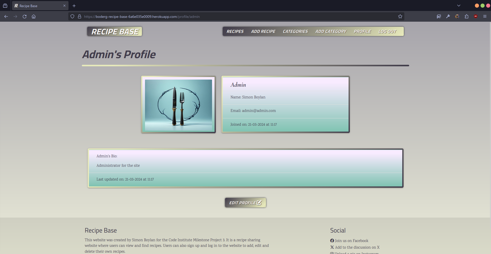
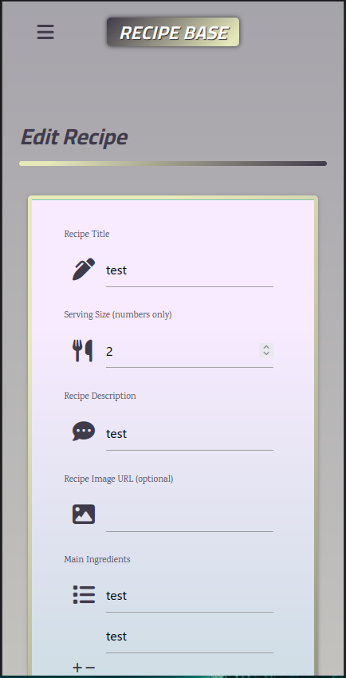
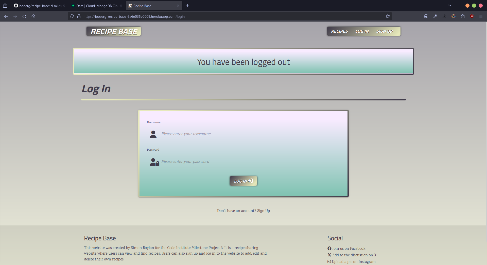
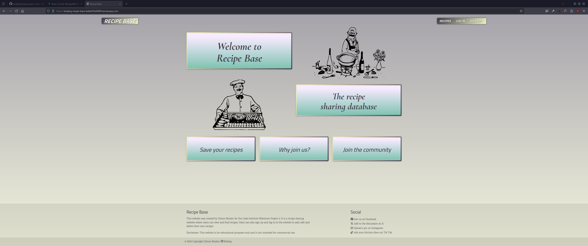
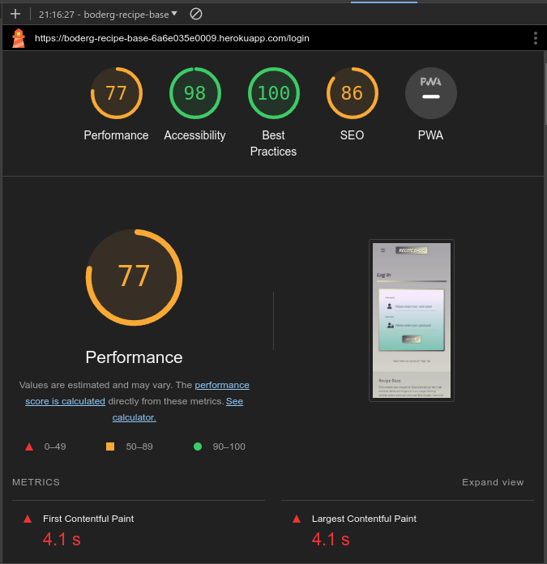

# Testing

Return back to the [README.md](README.md) file.

## Code Validation

This is where the code for the Recipe Base site has been tested by using the appropriate validation tools.

Here are the results of those tests:

<details>
<summary>Click to view the validation results for Recipe Base</summary>

### HTML

The recommended [HTML W3C Validator](https://validator.w3.org) was used to validate all of the Recipe Base HTML files.

All non registered user pages were validated by URI and registered user pages were validated by direct code input due to the validator not being to sign in to the site to access user only pages. The results are as follows:

| Page | W3C URL | Screenshot | Notes |
| --- | --- | --- | --- |
| Home | [W3C](https://validator.w3.org/nu/?doc=https%3A%2F%2Fboderg-recipe-base-6a6e035e0009.herokuapp.com%2F&__cf_chl_tk=jjLBKKIgrm.vlGx.8N.YKWzzkh4l.surR6kFpalgz0o-1711531247-0.0.1.1-1791) |   | 'Section lacks header h2-h6' warning. <br> This error is due to the flash banner section being injected only when needed so the checker can't find the flash banner section. <br> Corrected by changing the flash banner section to a div in the base html. |
| Recipes | [W3C](https://validator.w3.org/nu/?doc=https%3A%2F%2Fboderg-recipe-base-6a6e035e0009.herokuapp.com%2Fget_recipes) |    | 'Element h4 not allowed as child of element span in this context' error. <br> This was because a h4 element had been placed inside a span on the card-reveal section of the recipe cards. <br> Corrected by removing the h4 element.  |
| Recipe | [W3C](https://validator.w3.org/nu/?doc=https%3A%2F%2Fboderg-recipe-base-6a6e035e0009.herokuapp.com%2Frecipe%2F65fe70f93e67079aba088705) |   | Element ul not allowed as child of element h5 in this context. <br> Corrected by moving the closing h5 tag to the title and adding h6 tags into the list element. |
| Add Recipe | [W3C](https://validator.w3.org/nu/?doc=https%3A%2F%2Fboderg-recipe-base-6a6e035e0009.herokuapp.com%2Fadd_recipe) |   | 1. 'Attribute dropdown not allowed on element div at this point'. <br> Corrected by removing erroneous attribute. <br> 2. 'Element option without label attribute must not be empty'. <br> Corrected by adding text in the option field. <br> 3. 'The value of the for attribute of the label element must be the ID of a non-hidden form control'. <br> Corrected by adding an id to the select element. |
| Edit Recipe | [W3C](https://validator.w3.org/nu/?doc=https%3A%2F%2Fboderg-recipe-base-6a6e035e0009.herokuapp.com%2Fedit_recipe%2F65fe70f93e67079aba088705) |    | 1. 'Duplicate ID error'. <br> Corrected by adding a jinja2 loop ```{{ loop.index }}``` to the id of each pre populated list. <br> This added a and new error. <br> 2. The new error 'The value of the for attribute of the label element must be the ID of a non-hidden form control'. <br> Corrected by removing the 'for' attribute in the label and creating a new for label without text but with a jinja2 loop index inside of the jinja2 for loop with the input field. |
| Categories | [W3C](https://validator.w3.org/nu/?doc=https%3A%2F%2Fboderg-recipe-base-6a6e035e0009.herokuapp.com%2Fget_categories) |  | Pass: No Errors |
| Category | [W3C](https://validator.w3.org/nu/?doc=https%3A%2F%2Fboderg-recipe-base-6a6e035e0009.herokuapp.com%2Fsingle_category%2F65fb08febb5a2091ffa80826) |   | 'Element h4 not allowed as child of element span in this context' error. <br> This was because a h4 element had been placed inside a span on the card-reveal section of the recipe cards and copied over to the category cards. <br> Corrected by removing the h4 element. |
| Add Category | [W3C](https://validator.w3.org/nu/?doc=https%3A%2F%2Fboderg-recipe-base-6a6e035e0009.herokuapp.com%2Fadd_category) |  | Pass: No Errors  |
| Edit Category | [W3C](https://validator.w3.org/nu/?doc=https%3A%2F%2Fboderg-recipe-base-6a6e035e0009.herokuapp.com%2Fedit_category%2F65fb090abb5a2091ffa80827) |  | Pass: No Errors  |
| Profile | [W3C](https://validator.w3.org/nu/?doc=https%3A%2F%2Fboderg-recipe-base-6a6e035e0009.herokuapp.com%2Fprofile%2Fadmin) |  | Pass: No Errors  |
| Edit Profile | [W3C](https://validator.w3.org/nu/?doc=https%3A%2F%2Fboderg-recipe-base-6a6e035e0009.herokuapp.com%2Fedit_profile%2Fadmin) |  | Pass: No Errors  |
| Log In | [W3C](https://validator.w3.org/nu/?doc=https%3A%2F%2Fboderg-recipe-base-6a6e035e0009.herokuapp.com%2Flogin) |  | Pass: No Errors  |
| Register | [W3C](https://validator.w3.org/nu/?doc=https%3A%2F%2Fboderg-recipe-base-6a6e035e0009.herokuapp.com%2Fregister) |  | Pass: No Errors  |

### CSS

The recommended [CSS Jigsaw Validator](https://jigsaw.w3.org/css-validator) was used to validate all of the Recipe Base CSS files.

| File | Jigsaw URL | Screenshot | Notes |
| --- | --- | --- | --- |
| style.css | [Jigsaw](https://jigsaw.w3.org/css-validator/validator?uri=https%3A%2F%2Fboderg-recipe-base-6a6e035e0009.herokuapp.com%2F&profile=css3svg&usermedium=all&warning=1&vextwarning=&lang=en) |  | Errors generated by validator trying to check frameworks. |
| style.css | n/a |  | Pass: No Errors |

### JavaScript

The recommended [JShint Validator](https://jshint.com) was used to validate all of the Recipe Base JS files.

| File | Screenshot | Notes |
| --- | --- | --- |
| script.js |  | Unused variables are being used in the html code as onclick events. |

### Python

The recommended [PEP8 CI Python Linter](https://pep8ci.herokuapp.com) was used to validate all of the Recipe Base Python files.

| File | CI URL | Screenshot | Notes |
| --- | --- | --- | --- |
| app.py | [PEP8 CI](https://pep8ci.herokuapp.com/https://raw.githubusercontent.com/boderg/recipe-base/main/app.py) |   | ES01 line too long. <br> W293 blank line contains whitespace.. <br> W292 no new line at end of file. <br> This last one (W293) seems to be a quirk of GitHub. Copying the raw faile from GitHub seems to omit the empty line at the end of the file, however when edit is clicked, the newline is showing in the editor. |

</details>

## Browser Compatibility

The Recipe Base site has been tested using the following browsers:

- [Brave](https://brave.com/download)
- [Chrome](https://www.google.com/chrome)
- [Edge](https://www.microsoft.com/edge)
- [Firefox (Developer Edition)](https://www.mozilla.org/firefox/developer)
- [Safari](https://support.apple.com/downloads/safari)

The results of these tests are as follows and listed by browser:

<details>
<summary>Click to view the browser compatibility results for Recipe Base</summary>

### Brave

| Page | Screenshot | Notes |
| :---: | :---: | :---: |
| Home |  | Works as expected |
| Recipes |  | Works as expected |
| Recipe |  | Works as expected |
| Add Recipe |  | Works as expected |
| Edit Recipe |  | Works as expected |
| Categories |  | Works as expected |
| Category |  | Works as expected |
| Add Category |  | Works as expected |
| Edit Category |  | Works as expected |
| Profile |  | Works as expected |
| Edit Profile |  | Works as expected |
| Log In |  | Works as expected |
| Register |  | Works as expected |

### Chrome

| Page | Screenshot | Notes |
| :---: | :---: | :---: |
| Home |  | Works as expected |
| Recipes |  | Works as expected |
| Recipe |  | Works as expected |
| Add Recipe |  | Works as expected |
| Edit Recipe |  | Works as expected |
| Categories |  | Works as expected |
| Category |  | Works as expected |
| Add Category |  | Works as expected |
| Edit Category |  | Works as expected |
| Profile |  | Works as expected |
| Edit Profile |  | Works as expected |
| Log In |  | Works as expected |
| Register |  | Works as expected |

### Edge

| Page | Screenshot | Notes |
| :---: | :---: | :---: |
| Home |  | Works as expected |
| Recipes |  | Works as expected |
| Recipe |  | Works as expected |
| Add Recipe |  | Works as expected |
| Edit Recipe |  | Works as expected |
| Categories |  | Works as expected |
| Category |  | Works as expected |
| Add Category |  | Works as expected |
| Edit Category |  | Works as expected |
| Profile |  | Works as expected |
| Edit Profile |  | Works as expected |
| Log In |  | Works as expected |
| Register |  | Works as expected |

### Firefox Developer Edition

| Page | Screenshot | Notes |
| :---: | :---: | :---: |
| Home |  | Works as expected |
| Recipes |  | Works as expected |
| Recipe |  | Works as expected |
| Add Recipe |  | Works as expected |
| Edit Recipe |  | Works as expected |
| Categories |  | Works as expected |
| Category |  | Works as expected |
| Add Category |  | Works as expected |
| Edit Category |  | Works as expected |
| Profile |  | Works as expected |
| Edit Profile |  | Works as expected |
| Log In |  | Works as expected |
| Register |  | Works as expected |

### Safari

| Page | Screenshot | Notes |
| :---: | :---: | :---: |
| Home |  | Works as expected |
| Recipes |  | Works as expected |
| Recipe |  | Works as expected |
| Add Recipe |  | Works as expected |
| Edit Recipe |  | Works as expected |
| Categories |  | Works as expected |
| Category |  | Works as expected |
| Add Category |  | Works as expected |
| Edit Category |  | Works as expected |
| Profile |  | Works as expected |
| Edit Profile |  | Works as expected |
| Log In |  | Works as expected |
| Register |  | Works as expected |

</details>

## Responsiveness

The Recipe Base deployed project has been tested on multiple devices to check for responsiveness issues.

The results are as follows:

<details>
<summary>Click to view the responsive results for Recipe Base</summary>

### Mobile (Dev Tools - iPhone 12/13 Pro Max)

| Page | Screenshot | Notes |
| :---: | :---: | :---: |
| Home |  | Works as expected |
| Recipes |  | Works as expected |
| Recipe |  | Works as expected |
| Add Recipe |  | Works as expected |
| Edit Recipe |  | Works as expected |
| Categories |  | Works as expected |
| Category |  | Works as expected |
| Add Category |  | Works as expected |
| Edit Category |  | Works as expected |
| Profile |  | Works as expected |
| Edit Profile |  | Works as expected |
| Log In |  | Works as expected |
| Register |  | Works as expected |
| Sidenav |  | Works as expected |

### Tablet (Dev Tools - iPad Air)

| Page | Screenshot | Notes |
| :---: | :---: | :---: |
| Home |  | Works as expected |
| Recipes |  | Works as expected |
| Recipe |  | Works as expected |
| Add Recipe |  | Works as expected |
| Edit Recipe |  | Works as expected |
| Categories |  | Works as expected |
| Category |  | Works as expected |
| Add Category |  | Works as expected |
| Edit Category |  | Works as expected |
| Profile |  | Works as expected |
| Edit Profile |  | Works as expected |
| Log In |  | Works as expected |
| Register |  | Works as expected |
| Sidenav |  | Works as expected |

### Desktop 27" 1080p

| Page | Screenshot | Notes |
| :---: | :---: | :---: |
| Home |  | Works as expected |
| Recipes |  | Works as expected |
| Recipe |  | Works as expected |
| Add Recipe |  | Works as expected |
| Edit Recipe |  | Works as expected |
| Categories |  | Works as expected |
| Category |  | Works as expected |
| Add Category |  | Works as expected |
| Edit Category |  | Works as expected |
| Profile |  | Works as expected |
| Edit Profile |  | Works as expected |
| Log In |  | Works as expected |
| Register |  | Works as expected |

### Desktop 34" Ultrawide 1440p

| Page | Screenshot | Notes |
| :---: | :---: | :---: |
| Home |  | Works as expected |
| Recipes |  | Works as expected |
| Recipe |  | Works as expected |
| Add Recipe |  | Works as expected |
| Edit Recipe |  | Works as expected |
| Categories |  | Works as expected |
| Category |  | Works as expected |
| Add Category |  | Works as expected |
| Edit Category |  | Works as expected |
| Profile |  | Works as expected |
| Edit Profile |  | Works as expected |
| Log In |  | Works as expected |
| Register |  | Works as expected |

The only issue noted is the navbar cannot be made narrower using the standrd materialize framework without affecting the smaller screens.<br>
This would be something that can be worked on via css as a future development.

### Samsung Galaxy S10 plus

| Page | Screenshot | Notes |
| :---: | :---: | :---: |
| Home |  | Works as expected |
| Recipes |  | Works as expected |
| Recipe |  | Works as expected |
| Add Recipe |  | Works as expected |
| Edit Recipe |  | Works as expected |
| Categories |  | Works as expected |
| Category |  | Works as expected |
| Add Category |  | Works as expected |
| Edit Category |  | Works as expected |
| Profile |  | Works as expected |
| Edit Profile |  | Works as expected |
| Log In |  | Works as expected |
| Register |  | Works as expected |
| Sidenav |  | Works as expected |

</details>

## Lighthouse Audit

The deployed Recipe Base project has been tested using the Lighthouse Audit tool to check for any major issues.

<details>
<summary>Click here to view the lighthouse results for Recipe Base</summary>

| Page | Mobile | Desktop | Notes |
| --- | --- | --- | --- |
| Home |  |  | Slightly slower mobile performnce. |
| Recipes |  |  | Slightly slower mobile performnce. |
| Recipe |  |  | Slightly slower mobile performnce. |
| Add Recipe |  |  | Slightly slower performnce. |
| Edit Recipe |  |  | Slight drop in performance. |
| Categories |  |  | Slower performance. |
| Category |  |  | Slower mobile performance. |
| Add Category |  |  | Slight drop in optimisation. |
| Edit category |  |  | Slight drop in optimisation. Slight drop in performnce on mobile. |
| Profile |  |  | Slight drop in performance and optimisation on mobile. |
| Edit Profile |  |  | Slight drop in performance and optimisation on mobile. Small drop in optimisation on desktop. |
| Log In |  |  | Slight drop in mobile performance. Slight drop in optimisation. |
| Sign Up |  |  | Slight drop in mobile performance. Slight drop in optimisation. |

The main issue that slows down mobile rendering was showing on all pages. This issue was render blocking resources such as cloudfare cdnjs for materialize, image rendering and unused materialize css and js.

</details>

## Defensive Programming

🛑🛑🛑🛑🛑 START OF NOTES (to be deleted) 🛑🛑🛑🛑🛑

Defensive programming (defensive design) is extremely important!

When building projects that accept user inputs or forms, you should always test the level of security for each.
Examples of this could include (not limited to):

Forms:
- Users cannot submit an empty form
- Users must enter valid email addresses

PP3 (Python-only):
- Users must enter a valid letter/word/string when prompted
- Users must choose from a specific list only

MS3 (Flask) | MS4/PP4/PP5 (Django):
- Users cannot brute-force a URL to navigate to a restricted page
- Users cannot perform CRUD functionality while logged-out
- User-A should not be able to manipulate data belonging to User-B, or vice versa
- Non-Authenticated users should not be able to access pages that require authentication
- Standard users should not be able to access pages intended for superusers

You'll want to test all functionality on your application, whether it's a standard form,
or uses CRUD functionality for data manipulation on a database.
Make sure to include the `required` attribute on any form-fields that should be mandatory.
Try to access various pages on your site as different user types (User-A, User-B, guest user, admin, superuser).

You should include any manual tests performed, and the expected results/outcome.

Testing should be replicable.
Ideally, tests cases should focus on each individual section of every page on the website.
Each test case should be specific, objective, and step-wise replicable.

Instead of adding a general overview saying that everything works fine,
consider documenting tests on each element of the page
(ie. button clicks, input box validation, navigation links, etc.) by testing them in their happy flow,
and also the bad/exception flow, mentioning the expected and observed results,
and drawing a parallel between them where applicable.

Consider using the following format for manual test cases:

Expected Outcome / Test Performed / Result Received / Fixes Implemented

- **Expected**: "Feature is expected to ."
- **Testing**: "Tested the feature by ."
- (either) **Result**: "The feature behaved as expected, and ."
- (or) **Result**: "The feature "
- **Fix**: "Test concluded and passed.."

Use the table below as a basic start, and expand on it using the logic above.

🛑🛑🛑🛑🛑 END OF NOTES (to be deleted) 🛑🛑🛑🛑🛑

Defensive programming for Recipe Base was manually tested with the below user acceptance testing:

<details>
<summary>Click here to view the defensive testing results table for Recipe Base</summary>

| Page | Expectation | Test | Result | Fix | Screenshot |
| --- | --- | --- | --- | --- | --- |
| Home (non authorised users) | | | | | |
| | Brand logo is expected to act as a home button and open the home page. | Tested the feature by clickimg the Brand logo button. | The feature behaved as expected, returned to the home page. | Test concluded and passed. |  |
| | The 'Save your Recipes' card is expected to open a modal with information and a link to sign up to the site.  | Tested the feature by clicking on the 'Save your Recipes' card. | The feature behaved as expected, and opened the expected modal. | Test concluded and passed. |  |
| | The 'Why Join Us?' card is expected to open a modal with information and a link to sign up to the site. | Tested the feature by clicking on the 'Why Join Us?' card. | The feature behaved as expected, and opened the expected modal. | Test concluded and passed. |  |
| | The 'Join the Community' card is expected to open the Sign Up page. | Tested the feature by clicking on the 'Join the Community' card. | The feature behaved as expected, and opened the Sign Up page. | Test concluded and passed. |  |


| Home (authorised users) | | | | | |
| | The 'Save your Recipes' card is expected to open the Add Recipe page.  | Tested the feature by clicking on the 'Save your Recipes' card. | The feature behaved as expected, and opened the Add Recipe page. | Test concluded and passed. |  |
| | The 'Why Join Us?' card is expected to open the Recipes page. | Tested the feature by clicking on the 'Why Join Us?' card. | The feature behaved as expected, and opened the Recipes page. | Test concluded and passed. |  |
| | The 'Join the Community' card is expected to open the Recipes page. | Tested the feature by clicking on the 'Why Join Us?' card. | The feature behaved as expected, and opened the Recipes page. | Test concluded and passed. |  |


| Recipes | | | | | |
| | The Search button is expected to return results based on keyword entries in the search bar from words contained in the titles, ingredients and description. | Tested the feature by enetring different words. | The feature behaved as expected, and returned recipes if those words were present in either the titles, ingredients or description and returned 'No recipes found' if the words were not present. | Test concluded and passed. |  |
| | The Rest button is expected to reset the Recipes page back to it's normal designed display. | Tested the feature by clicking the Reset Button. | The feature behaved as expected and restored the normal display of the Recipes page. | Test concluded and passed. |  |
| | The Elipsis on the recipe cards is expected open the card reveal and show only the recipe ingredients and category. | Tested the feature by clicking on the Elipsis. | The feature behaved as expected, and opened the card reveal to display the recipe ingredients and the category.  | Test concluded and passed. |  |
| | The View Full Recipe button is expected to open the page that relates to the recipe to which card the button is on. | Tested the feature by clicking on different View Full Recipe buttons on different cards. | The feature behaved as expected, and opens each recipes relevant recipe page. | Test concluded and passed. |  |


| Recipe | | | | | |
| | The Back button is expected to return to the Recipes page. | Tested the feature by Clicking the Back button. | The feature behaved as expected, and returned to the Recipes page. | Test concluded and passed. |  |
| | The Edit button is expected to open the Edit Recipe page for the recipe that is open. | Tested the feature by clicking the Edit button. | The feature behaved as expected, and opened the Edit page for the relevant recipe. | Test concluded and passed. |  |
| | The Delete button is expected to open a delete modal to confirm deletion of the recipe that is open. | Tested the feature by clicking on the Delete button. | The feature behaved as expected, and opened the  delete modal. | Test concluded and passed. |  |


| Add Recipe | | | | | |
| | The Plus / Minus symbols are expected to add and remove new lines. | Tested the feature by clicking on the buttons. | The feature behaved as expected, and added a line when the plus symbol was clicked and removed a line when the minus symbol was clicked. | Test concluded and passed. |  |
| | The Dropdown Select is expected to open a dropdown selction of category checkboxes. | Tested the feature by clicking on the Dropdown Selector. | The feature behaved as expected, and opened the dropdown selection of category checkboxes. | Test concluded and passed. |  |
| | The Add Recipe button is expected to add the completed recipe form details to create a new recipe. | Tested the feature by completing the form and clicking the Add Recipe button. | The Add Recipe button behaved as expected, and added the completed form to the recipe database. | Test concluded and passed. |  |
| | The Cancel button is expected to return the user back to the Recipes page. | Tested the feature by clicking the Cancel button. | The feature behaved as expected, and returned back to the Recipes page. | Test concluded and passed. |  |


| Edit Recipe | | | | | |
| | The Plus / Minus symbols are expected to add and remove new lines. | Tested the feature by clicking on the buttons. | The feature behaved as expected, and added a line when the plus symbol was clicked and removed a line when the minus symbol was clicked. | Test concluded and passed. |  |
| | The Dropdown Select is expected to open a dropdown selction of category checkboxes. | Tested the feature by clicking on the Dropdown Selector. | The feature behaved as expected, and opened the dropdown selection of category checkboxes. | Test concluded and passed. |  |
| | The Update Recipe button is expected to update the completed recipe form details to edit a current recipe. | Tested the feature by completing the form and clicking the Update Recipe button. | The Update Recipe button behaved as expected, and updated the completed form to the recipe database. | Test concluded and passed. |  |
| | The Cancel button is expected to return the user back to the Recipes page. | Tested the feature by clicking the Cancel button. | The feature behaved as expected, and returned back to the Recipes page. | Test concluded and passed. |  |


| Categories | | | | | |
| | View Categories button is expected to open a page with all recipes associated with that category provided the recipe has had a category added. | Tested the feature by clicking on the View Categories button.  | The feature behaved as expected, and opened a page with recipes related to that category or an empty page with 'No Recipes Found' if there were none associated with that category.  | Test concluded and passed. |  |
| | Feature is expected to  | Tested the feature by  | The feature  | Test concluded and passed. |  |
| | Feature is expected to  | Tested the feature by  | The feature  | Test concluded and passed. |  |


| Category | | | | | |
| | Feature is expected to  | Tested the feature by  | The feature behaved as expected, and  | Test concluded and passed. |  |
| | Feature is expected to  | Tested the feature by  | The feature  | Test concluded and passed. |  |


| Add Category | | | | | |
| | Feature is expected to  | Tested the feature by  | The feature behaved as expected, and  | Test concluded and passed. |  |
| | Feature is expected to  | Tested the feature by  | The feature  | Test concluded and passed. |  |


| Edit Category | | | | | |
| | Feature is expected to  | Tested the feature by  | The feature behaved as expected, and  | Test concluded and passed. |  |
| | Feature is expected to  | Tested the feature by  | The feature  | Test concluded and passed. |  |


| Profile | | | | | |
| | Feature is expected to  | Tested the feature by  | The feature behaved as expected, and  | Test concluded and passed. |  |
| | Feature is expected to  | Tested the feature by  | The feature  | Test concluded and passed. |  |


| Edit Profile | | | | | |
| | Feature is expected to  | Tested the feature by  | The feature behaved as expected, and  | Test concluded and passed. |  |
| | Feature is expected to  | Tested the feature by  | The feature  | Test concluded and passed. |  |


| Log In | | | | | |
| | Feature is expected to  | Tested the feature by  | The feature behaved as expected, and  | Test concluded and passed. |  |
| | Feature is expected to  | Tested the feature by  | The feature  | Test concluded and passed. |  |


| Sign Up | | | | | |
| | Feature is expected to  | Tested the feature by  | The feature behaved as expected, and  | Test concluded and passed. |  |
| | Feature is expected to  | Tested the feature by  | The feature  | Test concluded and passed. |  |


| Navigation | | | | | |
| | Recipes button is expected to take the user to the recipes page with limited access. | Tested the feature by clicking the recipes button. | The feature behaved as expected and opened the recipes page with restricted access. | Test concluded and passed. |  |
| | Feature is expected to  | Tested the feature by  | The feature  | Test concluded and passed. |  |

| Footer | | | | | |
| | The Social links are expected to open the relevant socila sites in a new tab on the browser. | Tested the each social link by clicking each link. | The social links behaved as expected, and opened their respective pages in a new tab on the browser. | Test concluded and passed. |  |
| | The GitHub link is expected to open the site creators GitHub page in a new tab on the browser. | Tested the feature by clicking on the GitHub link. | The feature behaved as expected and opened the site creators GitHub page in a new tab on the browser. | Test concluded and passed.|  |


| Sidenav | | | | | |
| | Feature is expected to  | Tested the feature by  | The feature behaved as expected, and  | Test concluded and passed. |  |
| | Feature is expected to  | Tested the feature by  | The feature  | Test concluded and passed. |  |

| Modals | | | | | |
| | Feature is expected to  | Tested the feature by  | The feature behaved as expected, and  | Test concluded and passed. |  |
| | Feature is expected to  | Tested the feature by  | The feature  | Test concluded and passed. |  |

</details>

## User Story Testing

🛑🛑🛑🛑🛑 START OF NOTES (to be deleted) 🛑🛑🛑🛑🛑

Testing user stories is actually quite simple, once you've already got the stories defined on your README.

Most of your project's **features** should already align with the **user stories**,
so this should as simple as creating a table with the user story, matching with the re-used screenshot
from the respective feature.

🛑🛑🛑🛑🛑 END OF NOTES (to be deleted) 🛑🛑🛑🛑🛑

| User Story | Screenshot |
| --- | --- |
| As a new site user, I would like to ____________, so that I can ____________. |  |
| As a new site user, I would like to ____________, so that I can ____________. |  |
| As a new site user, I would like to ____________, so that I can ____________. |  |
| As a returning site user, I would like to ____________, so that I can ____________. |  |
| As a returning site user, I would like to ____________, so that I can ____________. |  |
| As a returning site user, I would like to ____________, so that I can ____________. |  |
| As a site administrator, I should be able to ____________, so that I can ____________. |  |
| As a site administrator, I should be able to ____________, so that I can ____________. |  |
| As a site administrator, I should be able to ____________, so that I can ____________. |  |
| repeat for all remaining user stories | x |

## Automated Testing

I have conducted a series of automated tests on my application.

I fully acknowledge and understand that, in a real-world scenario, an extensive set of additional tests would be more comprehensive.

### JavaScript (Jest Testing)

🛑🛑🛑🛑🛑 START OF NOTES (to be deleted) 🛑🛑🛑🛑🛑

Adjust the code below (file names, etc.) to match your own project files/folders.

🛑🛑🛑🛑🛑 END OF NOTES (to be deleted) 🛑🛑🛑🛑🛑

I have used the [Jest](https://jestjs.io) JavaScript testing framework to test the application functionality.

In order to work with Jest, I first had to initialize NPM.

- `npm init`
- Hit `enter` for all options, except for **test command:**, just type `jest`.

Add Jest to a list called **Dev Dependencies** in a dev environment:

- `npm install --save-dev jest`

**IMPORTANT**: Initial configurations

When creating test files, the name of the file needs to be `file-name.test.js` in order for Jest to properly work.

Without the following, Jest won't properly run the tests:

- `npm install -D jest-environment-jsdom`

Due to a change in Jest's default configuration, you'll need to add the following code to the top of the `.test.js` file:

```js
/**
 * @jest-environment jsdom
 */

const { test, expect } = require("@jest/globals");
const { function1, function2, function3, etc. } = require("../script-name");

beforeAll(() => {
    let fs = require("fs");
    let fileContents = fs.readFileSync("index.html", "utf-8");
    document.open();
    document.write(fileContents);
    document.close();
});
```

Remember to adjust the `fs.readFileSync()` to the specific file you'd like you test.
The example above is testing the `index.html` file.

Finally, at the bottom of the script file where your primary scripts are written, include the following at the bottom of the file.
Make sure to include the name of all of your functions that are being tested in the `.test.js` file.

```js
if (typeof module !== "undefined") module.exports = {
    function1, function2, function3, etc.
};
```

Now that these steps have been undertaken, further tests can be written, and be expected to fail initially.
Write JS code that can get the tests to pass as part of the Red-Green refactor process.

Once ready, to run the tests, use this command:

- `npm test`

**NOTE**: To obtain a coverage report, use the following command:

- `npm test --coverage`

Below are the results from the tests that I've written for this application:

| Test Suites | Tests | Screenshot |
| --- | --- | --- |
| 1 passed | 16 passed |  |
| x | x | repeat for all remaining tests |

#### Jest Test Issues

🛑🛑🛑🛑🛑 START OF NOTES (to be deleted) 🛑🛑🛑🛑🛑

Use this section to list any known issues you ran into while writing your Jest tests.
Remember to include screenshots (where possible), and a solution to the issue (if known).

This can be used for both "fixed" and "unresolved" issues.

🛑🛑🛑🛑🛑 END OF NOTES (to be deleted) 🛑🛑🛑🛑🛑

### Python (Unit Testing)

🛑🛑🛑🛑🛑 START OF NOTES (to be deleted) 🛑🛑🛑🛑🛑

Adjust the code below (file names, etc.) to match your own project files/folders.

🛑🛑🛑🛑🛑 END OF NOTES (to be deleted) 🛑🛑🛑🛑🛑

I have used Django's built-in unit testing framework to test the application functionality.

In order to run the tests, I ran the following command in the terminal each time:

`python3 manage.py test name-of-app `

To create the coverage report, I would then run the following commands:

`coverage run --source=name-of-app manage.py test`

`coverage report`

To see the HTML version of the reports, and find out whether some pieces of code were missing, I ran the following commands:

`coverage html`

`python3 -m http.server`

Below are the results from the various apps on my application that I've tested:

| App | File | Coverage | Screenshot |
| --- | --- | --- | --- |
| Bag | test_forms.py | 99% |  |
| Bag | test_models.py | 89% |  |
| Bag | test_urls.py | 100% |  |
| Bag | test_views.py | 71% |  |
| Checkout | test_forms.py | 99% |  |
| Checkout | test_models.py | 89% |  |
| Checkout | test_urls.py | 100% |  |
| Checkout | test_views.py | 71% |  |
| Home | test_forms.py | 99% |  |
| Home | test_models.py | 89% |  |
| Home | test_urls.py | 100% |  |
| Home | test_views.py | 71% |  |
| Products | test_forms.py | 99% |  |
| Products | test_models.py | 89% |  |
| Products | test_urls.py | 100% |  |
| Products | test_views.py | 71% |  |
| Profiles | test_forms.py | 99% |  |
| Profiles | test_models.py | 89% |  |
| Profiles | test_urls.py | 100% |  |
| Profiles | test_views.py | 71% |  |
| x | x | x | repeat for all remaining tested apps/files |

#### Unit Test Issues

🛑🛑🛑🛑🛑 START OF NOTES (to be deleted) 🛑🛑🛑🛑🛑

Use this section to list any known issues you ran into while writing your unit tests.
Remember to include screenshots (where possible), and a solution to the issue (if known).

This can be used for both "fixed" and "unresolved" issues.

🛑🛑🛑🛑🛑 END OF NOTES (to be deleted) 🛑🛑🛑🛑🛑

## Bugs

- I created an event listener to add new input fields in the add recipe page. This listener adds a new  input field under ingredients and instructions when the previous field is populated allowing for ingredients and instructions to be added individually. The event listener has a blur function to remove any created field if it is not populated. This removal only works if you tab to the next input field and on sumbission of the form adds empty list items to the recipe. This also occurs on the edit recipe page as it uses the same function.


- To fix this, I _____________________.

- When entering the edit recipe page the first item in a list overlaps the label for that list until that list item is selected for editing.


- To fix this, I _____________________.

- Jinja2 `'Undefined Error'` while trying to set a delete button with a confirmation modal on my categories page I was getting this error saying that 'category' was not defined. I tried to fix at first by adding a jinja2 for loop to the modal but this resulted in multiple delete buttons as in image 2.

| Error | Failed solution | Solution |
| :---: | :---: | :---: |
|  |  |  |

- To fix this, I moved the modal structure inside of the jinja2 for loop and appended the modal id with the category id.

- Werkzeug `Build error` could not build endpoint single_recipe with values [recipe_id].

| Error description | Error code | Solution |
| :---: | :---: | :---: |
|  |  |  |

- To fix this, I renamed all 'single_recipe' entries to 'recipe' in the app routing along with the name of the recipe.html page.

- Python `E501 line too long` (93 > 79 characters)


- To fix this, I _____________________.

## Unfixed Bugs

🛑🛑🛑🛑🛑 START OF NOTES (to be deleted) 🛑🛑🛑🛑🛑

You will need to mention unfixed bugs and why they were not fixed.
This section should include shortcomings of the frameworks or technologies used.
Although time can be a big variable to consider, paucity of time and difficulty understanding
implementation is not a valid reason to leave bugs unfixed.

If you've identified any unfixed bugs, no matter how small, be sure to list them here.
It's better to be honest and list them, because if it's not documented and an assessor finds the issue,
they need to know whether or not you're aware of them as well, and why you've not corrected/fixed them.

Some examples:

🛑🛑🛑🛑🛑 END OF NOTES (to be deleted) 🛑🛑🛑🛑🛑

- On devices smaller than 375px, the page starts to have `overflow-x` scrolling.

    

  - Attempted fix: I tried to add additional media queries to handle this, but things started becoming too small to read.

- For PP3, when using a helper `clear()` function, any text above the height of the terminal does not clear, and remains when you scroll up.

    

  - Attempted fix: I tried to adjust the terminal size, but it only resizes the actual terminal, not the allowable area for text.

- When validating HTML with a semantic `section` element, the validator warns about lacking a header `h2-h6`. This is acceptable.

    

  - Attempted fix: this is a known warning and acceptable, and my section doesn't require a header since it's dynamically added via JS.

🛑🛑🛑🛑🛑 START OF NOTES (to be deleted) 🛑🛑🛑🛑🛑

If you legitimately cannot find any unfixed bugs or warnings, then use the following sentence:

🛑🛑🛑🛑🛑 END OF NOTES (to be deleted) 🛑🛑🛑🛑🛑

There are no remaining bugs that I am aware of.
