# Testing

Return back to the [README.md](README.md) file.

## Code Validation

This is where the code for the Recipe Base site has been tested by using the appropriate validation tools.

Here are the results of those tests:

<details>
<summary>Click to view the validation results for Recipe Base</summary>

### HTML

The recommended [HTML W3C Validator](https://validator.w3.org) was used to validate all of the Recipe Base HTML files.

All non registered user pages were validated by URI and registered user pages were validated by direct code input due to the validator not being to sign in to the site to access user only pages. The results are as follows:

| Page | W3C URL | Screenshot | Notes |
| --- | --- | --- | --- |
| Home | [W3C](https://validator.w3.org/nu/?doc=https%3A%2F%2Fboderg-recipe-base-6a6e035e0009.herokuapp.com%2F&__cf_chl_tk=jjLBKKIgrm.vlGx.8N.YKWzzkh4l.surR6kFpalgz0o-1711531247-0.0.1.1-1791) |   | 'Section lacks header h2-h6' warning. <br> This error is due to the flash banner section being injected only when needed so the checker can't find the flash banner section. <br> Corrected by changing the flash banner section to a div in the base html. |
| Recipes | [W3C](https://validator.w3.org/nu/?doc=https%3A%2F%2Fboderg-recipe-base-6a6e035e0009.herokuapp.com%2Fget_recipes) |    | 'Element h4 not allowed as child of element span in this context' error. <br> This was because a h4 element had been placed inside a span on the card-reveal section of the recipe cards. <br> Corrected by removing the h4 element.  |
| Recipe | [W3C](https://validator.w3.org/nu/?doc=https%3A%2F%2Fboderg-recipe-base-6a6e035e0009.herokuapp.com%2Frecipe%2F65fe70f93e67079aba088705) |   | Element ul not allowed as child of element h5 in this context. <br> Corrected by moving the closing h5 tag to the title and adding h6 tags into the list element. |
| Add Recipe | [W3C](https://validator.w3.org/nu/?doc=https%3A%2F%2Fboderg-recipe-base-6a6e035e0009.herokuapp.com%2Fadd_recipe) |   | 1. 'Attribute dropdown not allowed on element div at this point'. <br> Corrected by removing erroneous attribute. <br> 2. 'Element option without label attribute must not be empty'. <br> Corrected by adding text in the option field. <br> 3. 'The value of the for attribute of the label element must be the ID of a non-hidden form control'. <br> Corrected by adding an id to the select element. |
| Edit Recipe | [W3C](https://validator.w3.org/nu/?doc=https%3A%2F%2Fboderg-recipe-base-6a6e035e0009.herokuapp.com%2Fedit_recipe%2F65fe70f93e67079aba088705) |    | 1. 'Duplicate ID error'. <br> Corrected by adding a jinja2 loop ```{{ loop.index }}``` to the id of each pre populated list. <br> This added a and new error. <br> 2. The new error 'The value of the for attribute of the label element must be the ID of a non-hidden form control'. <br> Corrected by removing the 'for' attribute in the label and creating a new for label without text but with a jinja2 loop index inside of the jinja2 for loop with the input field. |
| Categories | [W3C](https://validator.w3.org/nu/?doc=https%3A%2F%2Fboderg-recipe-base-6a6e035e0009.herokuapp.com%2Fget_categories) |  | Pass: No Errors |
| Category | [W3C](https://validator.w3.org/nu/?doc=https%3A%2F%2Fboderg-recipe-base-6a6e035e0009.herokuapp.com%2Fsingle_category%2F65fb08febb5a2091ffa80826) |   | 'Element h4 not allowed as child of element span in this context' error. <br> This was because a h4 element had been placed inside a span on the card-reveal section of the recipe cards and copied over to the category cards. <br> Corrected by removing the h4 element. |
| Add Category | [W3C](https://validator.w3.org/nu/?doc=https%3A%2F%2Fboderg-recipe-base-6a6e035e0009.herokuapp.com%2Fadd_category) |  | Pass: No Errors  |
| Edit Category | [W3C](https://validator.w3.org/nu/?doc=https%3A%2F%2Fboderg-recipe-base-6a6e035e0009.herokuapp.com%2Fedit_category%2F65fb090abb5a2091ffa80827) |  | Pass: No Errors  |
| Profile | [W3C](https://validator.w3.org/nu/?doc=https%3A%2F%2Fboderg-recipe-base-6a6e035e0009.herokuapp.com%2Fprofile%2Fadmin) |  | Pass: No Errors  |
| Edit Profile | [W3C](https://validator.w3.org/nu/?doc=https%3A%2F%2Fboderg-recipe-base-6a6e035e0009.herokuapp.com%2Fedit_profile%2Fadmin) |  | Pass: No Errors  |
| Log In | [W3C](https://validator.w3.org/nu/?doc=https%3A%2F%2Fboderg-recipe-base-6a6e035e0009.herokuapp.com%2Flogin) |  | Pass: No Errors  |
| Register | [W3C](https://validator.w3.org/nu/?doc=https%3A%2F%2Fboderg-recipe-base-6a6e035e0009.herokuapp.com%2Fregister) |  | Pass: No Errors  |

### CSS

The recommended [CSS Jigsaw Validator](https://jigsaw.w3.org/css-validator) was used to validate all of the Recipe Base CSS files.

| File | Jigsaw URL | Screenshot | Notes |
| --- | --- | --- | --- |
| style.css | [Jigsaw](https://jigsaw.w3.org/css-validator/validator?uri=https%3A%2F%2Fboderg-recipe-base-6a6e035e0009.herokuapp.com%2F&profile=css3svg&usermedium=all&warning=1&vextwarning=&lang=en) |  | Errors generated by validator trying to check frameworks. |
| style.css | n/a |  | Pass: No Errors |

### JavaScript

The recommended [JShint Validator](https://jshint.com) was used to validate all of the Recipe Base JS files.

| File | Screenshot | Notes |
| --- | --- | --- |
| script.js |  | Unused variables are being used in the html code as onclick events. |

### Python

The recommended [PEP8 CI Python Linter](https://pep8ci.herokuapp.com) was used to validate all of the Recipe Base Python files.

| File | CI URL | Screenshot | Notes |
| --- | --- | --- | --- |
| app.py | [PEP8 CI](https://pep8ci.herokuapp.com/https://raw.githubusercontent.com/boderg/recipe-base/main/app.py) |   | ES01 line too long. <br> W293 blank line contains whitespace.. <br> W292 no new line at end of file. <br> This last one (W293) seems to be a quirk of GitHub. Copying the raw file from GitHub seems to omit the empty line at the end of the file, however when edit is clicked in the GitHub editor, the newline is shows. <br> All errors corrected. |

</details>

## Browser Compatibility

The Recipe Base site has been tested using the following browsers:

- [Brave](https://brave.com/download)
- [Chrome](https://www.google.com/chrome)
- [Edge](https://www.microsoft.com/edge)
- [Firefox (Developer Edition)](https://www.mozilla.org/firefox/developer)
- [Safari](https://support.apple.com/downloads/safari)

The results of these tests are as follows and listed by browser:

<details>
<summary>Click to view the browser compatibility results for Recipe Base</summary>

### Brave

| Page | Screenshot | Notes |
| :---: | :---: | :---: |
| Home |  | Works as expected |
| Recipes |  | Works as expected |
| Recipe |  | Works as expected |
| Add Recipe |  | Works as expected |
| Edit Recipe |  | Works as expected |
| Categories |  | Works as expected |
| Category |  | Works as expected |
| Add Category |  | Works as expected |
| Edit Category | 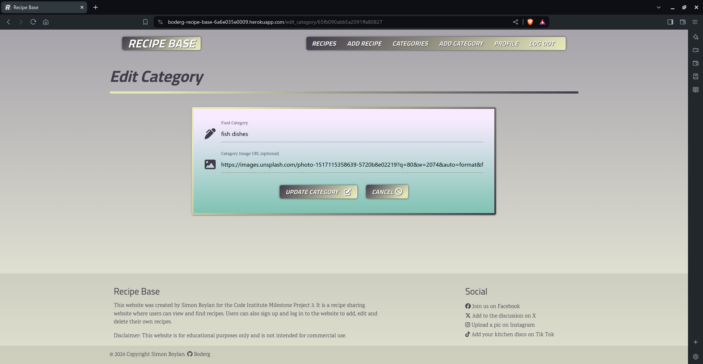 | Works as expected |
| Profile |  | Works as expected |
| Edit Profile |  | Works as expected |
| Log In |  | Works as expected |
| Register |  | Works as expected |

### Chrome

| Page | Screenshot | Notes |
| :---: | :---: | :---: |
| Home |  | Works as expected |
| Recipes |  | Works as expected |
| Recipe | 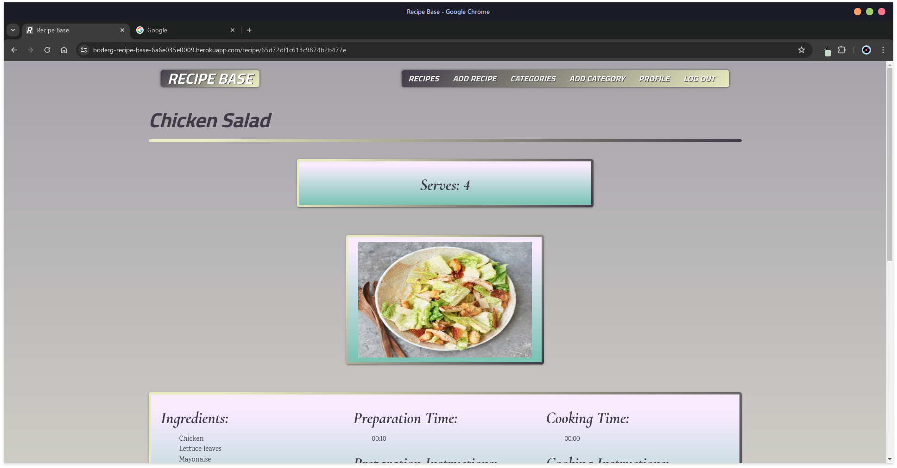 | Works as expected |
| Add Recipe |  | Works as expected |
| Edit Recipe |  | Works as expected |
| Categories |  | Works as expected |
| Category |  | Works as expected |
| Add Category |  | Works as expected |
| Edit Category |  | Works as expected |
| Profile |  | Works as expected |
| Edit Profile |  | Works as expected |
| Log In |  | Works as expected |
| Register |  | Works as expected |

### Edge

| Page | Screenshot | Notes |
| :---: | :---: | :---: |
| Home |  | Works as expected |
| Recipes |  | Works as expected |
| Recipe |  | Works as expected |
| Add Recipe |  | Works as expected |
| Edit Recipe |  | Works as expected |
| Categories |  | Works as expected |
| Category |  | Works as expected |
| Add Category |  | Works as expected |
| Edit Category |  | Works as expected |
| Profile |  | Works as expected |
| Edit Profile |  | Works as expected |
| Log In |  | Works as expected |
| Register |  | Works as expected |

### Firefox Developer Edition

| Page | Screenshot | Notes |
| :---: | :---: | :---: |
| Home |  | Works as expected |
| Recipes |  | Works as expected |
| Recipe |  | Works as expected |
| Add Recipe |  | Works as expected |
| Edit Recipe |  | Works as expected |
| Categories |  | Works as expected |
| Category |  | Works as expected |
| Add Category |  | Works as expected |
| Edit Category |  | Works as expected |
| Profile |  | Works as expected |
| Edit Profile |  | Works as expected |
| Log In |  | Works as expected |
| Register |  | Works as expected |

### Safari

| Page | Screenshot | Notes |
| :---: | :---: | :---: |
| Home |  | Works as expected |
| Recipes |  | Works as expected |
| Recipe |  | Works as expected |
| Add Recipe |  | Works as expected |
| Edit Recipe |  | Works as expected |
| Categories |  | Works as expected |
| Category |  | Works as expected |
| Add Category |  | Works as expected |
| Edit Category |  | Works as expected |
| Profile |  | Works as expected |
| Edit Profile |  | Works as expected |
| Log In |  | Works as expected |
| Register | 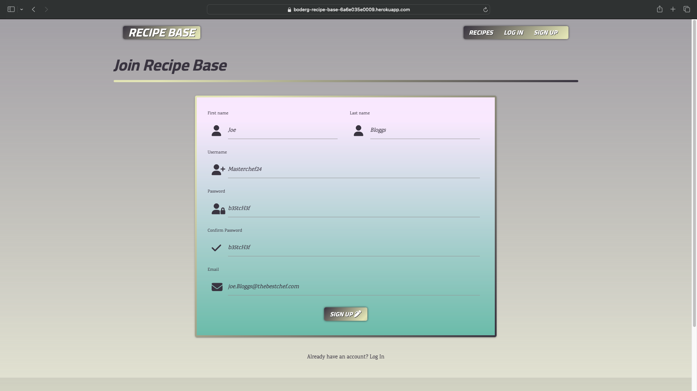 | Works as expected |

</details>

## Responsiveness

The Recipe Base deployed project has been tested on multiple devices to check for responsiveness issues.

The results are as follows:

<details>
<summary>Click to view the responsive results for Recipe Base</summary>

### Mobile (Dev Tools - iPhone 12/13 Pro Max)

| Page | Screenshot | Notes |
| :---: | :---: | :---: |
| Home |  | Works as expected |
| Recipes |  | Works as expected |
| Recipe |  | Works as expected |
| Add Recipe |  | Works as expected |
| Edit Recipe |  | Works as expected |
| Categories |  | Works as expected |
| Category | 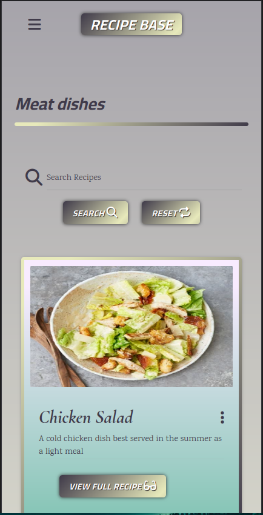 | Works as expected |
| Add Category |  | Works as expected |
| Edit Category |  | Works as expected |
| Profile | 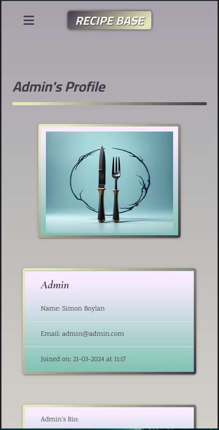 | Works as expected |
| Edit Profile |  | Works as expected |
| Log In |  | Works as expected |
| Register |  | Works as expected |
| Sidenav |  | Works as expected |

### Tablet (Dev Tools - iPad Air)

| Page | Screenshot | Notes |
| :---: | :---: | :---: |
| Home |  | Works as expected |
| Recipes |  | Works as expected |
| Recipe |  | Works as expected |
| Add Recipe |  | Works as expected |
| Edit Recipe |  | Works as expected |
| Categories | 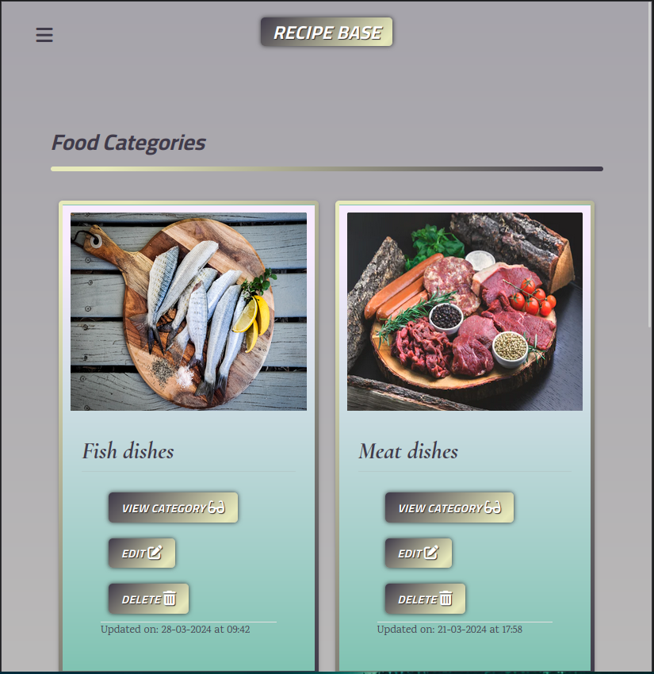 | Works as expected |
| Category |  | Works as expected |
| Add Category |  | Works as expected |
| Edit Category |  | Works as expected |
| Profile |  | Works as expected |
| Edit Profile |  | Works as expected |
| Log In |  | Works as expected |
| Register |  | Works as expected |
| Sidenav |  | Works as expected |

### Desktop 27" 1080p

| Page | Screenshot | Notes |
| :---: | :---: | :---: |
| Home |  | Works as expected |
| Recipes |  | Works as expected |
| Recipe |  | Works as expected |
| Add Recipe |  | Works as expected |
| Edit Recipe |  | Works as expected |
| Categories |  | Works as expected |
| Category |  | Works as expected |
| Add Category |  | Works as expected |
| Edit Category |  | Works as expected |
| Profile |  | Works as expected |
| Edit Profile |  | Works as expected |
| Log In |  | Works as expected |
| Register |  | Works as expected |

### Desktop 34" Ultrawide 1440p

| Page | Screenshot | Notes |
| :---: | :---: | :---: |
| Home |  | Works as expected |
| Recipes |  | Works as expected |
| Recipe |  | Works as expected |
| Add Recipe |  | Works as expected |
| Edit Recipe |  | Works as expected |
| Categories |  | Works as expected |
| Category |  | Works as expected |
| Add Category |  | Works as expected |
| Edit Category |  | Works as expected |
| Profile |  | Works as expected |
| Edit Profile |  | Works as expected |
| Log In |  | Works as expected |
| Register |  | Works as expected |

The only issue noted is the navbar cannot be made narrower using the standard materialize framework without affecting the smaller screens.<br>
This is something that could be adjusted using css as a future development.

### Samsung Galaxy S10 plus

| Page | Screenshot | Notes |
| :---: | :---: | :---: |
| Home |  | Works as expected |
| Recipes |  | Works as expected |
| Recipe |  | Works as expected |
| Add Recipe |  | Works as expected |
| Edit Recipe |  | Works as expected |
| Categories |  | Works as expected |
| Category |  | Works as expected |
| Add Category |  | Works as expected |
| Edit Category |  | Works as expected |
| Profile |  | Works as expected |
| Edit Profile |  | Works as expected |
| Log In |  | Works as expected |
| Register |  | Works as expected |
| Sidenav |  | Works as expected |

</details>

## Lighthouse Audit

The deployed Recipe Base project has been tested using the Lighthouse Audit tool to check for any major issues.

<details>
<summary>Click here to view the lighthouse results for Recipe Base</summary>

| Page | Mobile | Desktop | Notes |
| --- | --- | --- | --- |
| Home |  |  | Slight drop in mobile performance and optimisation. |
| Recipes |  |  | Slightly slower mobile performance. |
| Recipe |  |  | Slight drop in mobile optimisation. |
| Add Recipe |  | 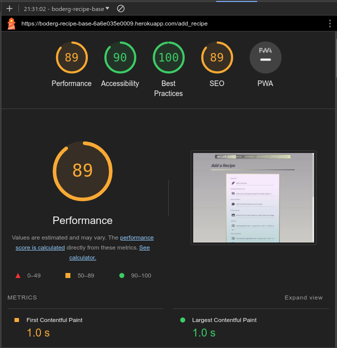 | Slight drop in performance and optimisation. |
| Edit Recipe |  |  | Slight drop in performance and optimisation. |
| Categories |  |  | Slower performance. |
| Category |  |  | Slower mobile performance and drop in optimisation. |
| Add Category |  |  | Slight drop in optimisation. |
| Edit category |  |  | Slight drop in optimisation. Slight drop in performance on mobile. |
| Profile |  |  | Slight drop in performance and optimisation on mobile. |
| Edit Profile |  |  | Slight drop in performance and optimisation on mobile. Small drop in optimisation on desktop. |
| Log In |  |  | Slight drop in mobile performance. Slight drop in optimisation. |
| Sign Up |  |  | Slight drop in mobile performance. Slight drop in optimisation. |

The main issue that slows down mobile rendering was showing on all pages. This issue was render blocking resources such as cloudfare cdnjs for materialize, image rendering and unused materialize css and js.

</details>

## Wave Compatibility

The deployed Recipe Base site was tested using the Wave Compatibility tester, however the Wave tester could only test pages that were not signed into as it does not have access to secured pages.
The following results are from the only pages that were able to be tested.

| Home | Recipes | Log In | Sign Up |
| :---: | :---: | :---: | :---: |
|  |  |  |  |

## Defensive Programming

Defensive programming for Recipe Base was manually tested with the below user acceptance testing:

<details>
<summary>Click here to view the defensive testing results table for Recipe Base</summary>

| Page | Expectation | Test | Result | Fix | Screenshot |
| --- | --- | --- | --- | --- | --- |
| Home (non authorised users) | | | | | |
| | Brand logo is expected to act as a home button and open the home page. | Tested the feature by clickimg the Brand logo button. | The feature behaved as expected, returned to the home page. | Test concluded and passed. |  |
| | The 'Save your Recipes' card is expected to open a modal with information and a link to sign up to the site.  | Tested the feature by clicking on the 'Save your Recipes' card. | The feature behaved as expected, and opened the expected modal. | Test concluded and passed. |  |
| | The 'Why Join Us?' card is expected to open a modal with information and a link to sign up to the site. | Tested the feature by clicking on the 'Why Join Us?' card. | The feature behaved as expected, and opened the expected modal. | Test concluded and passed. |  |
| | The 'Join the Community' card is expected to open the Sign Up page. | Tested the feature by clicking on the 'Join the Community' card. | The feature behaved as expected, and opened the Sign Up page. | Test concluded and passed. |  |
| Home (authorised users) | | | | | |
| | The 'Save your Recipes' card is expected to open the Add Recipe page.  | Tested the feature by clicking on the 'Save your Recipes' card. | The feature behaved as expected, and opened the Add Recipe page. | Test concluded and passed. |  |
| | The 'Why Join Us?' card is expected to open the Recipes page. | Tested the feature by clicking on the 'Why Join Us?' card. | The feature behaved as expected, and opened the Recipes page. | Test concluded and passed. |  |
| | The 'Join the Community' card is expected to open the Recipes page. | Tested the feature by clicking on the 'Why Join Us?' card. | The feature behaved as expected, and opened the Recipes page. | Test concluded and passed. |  |
| Home (mobile screens) | | | | | |
| | The Menu Bars are expected to open the sidenav on smaller screens that cannot accomodate the full nav bar. | Tested the feature by clicking on the Menu Bars.  | The feature behaved as expected, and opened the sidenav on the left of the screen.  | Test concluded and passed. |  |
| Recipes | | | | | |
| | The Search button is expected to return results based on keyword entries in the search bar from words contained in the titles, ingredients and description. | Tested the feature by enetring different words. | The feature behaved as expected, and returned recipes if those words were present in either the titles, ingredients or description and returned 'No recipes found' if the words were not present. | Test concluded and passed. |  |
| | The Rest button is expected to reset the Recipes page back to it's normal designed display. | Tested the feature by clicking the Reset Button. | The feature behaved as expected and restored the normal display of the Recipes page. | Test concluded and passed. |  |
| | The Elipsis on the recipe cards is expected open the card reveal and show only the recipe ingredients and category. | Tested the feature by clicking on the Elipsis. | The feature behaved as expected, and opened the card reveal to display the recipe ingredients and the category.  | Test concluded and passed. |  |
| | The View Full Recipe button is expected to open the page that relates to the recipe to which card the button is on. | Tested the feature by clicking on different View Full Recipe buttons on different cards. | The feature behaved as expected, and opens each recipes relevant recipe page. | Test concluded and passed. |  |
| Recipe | | | | | |
| | The Back button is expected to return to the Recipes page. | Tested the feature by Clicking the Back button. | The feature behaved as expected, and returned to the Recipes page. | Test concluded and passed. |  |
| | The Edit button is expected to open the Edit Recipe page for the recipe that is open. | Tested the feature by clicking the Edit button. | The feature behaved as expected, and opened the Edit page for the relevant recipe. | Test concluded and passed. |  |
| | The Delete button is expected to open a delete modal to confirm deletion of the recipe that is open. | Tested the feature by clicking on the Delete button. | The feature behaved as expected, and opened the  delete modal. | Test concluded and passed. |  |
| Add Recipe | | | | | |
| | The Plus / Minus symbols are expected to add and remove new lines. | Tested the feature by clicking on the buttons. | The feature behaved as expected, and added a line when the plus symbol was clicked and removed a line when the minus symbol was clicked. | Test concluded and passed. | 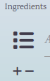 |
| | The Dropdown Select is expected to open a dropdown selction of category checkboxes. | Tested the feature by clicking on the Dropdown Selector. | The feature behaved as expected, and opened the dropdown selection of category checkboxes. | Test concluded and passed. |  |
| | The Add Recipe button is expected to add the completed recipe form details to create a new recipe. | Tested the feature by completing the form and clicking the Add Recipe button. | The Add Recipe button behaved as expected, and added the completed form to the recipe database. | Test concluded and passed. |  |
| | The Cancel button is expected to return the user back to the Recipes page. | Tested the feature by clicking the Cancel button. | The feature behaved as expected, and returned back to the Recipes page. | Test concluded and passed. |  |
| | Form validation is expected to prevent the Add Recipe submission if there is no data entered. | Tested by completing the form and leaving various blank entries. | The form validation did not act as expected and entered blank entries into the recipe database. | To fix this the 'required' attribute was added to the input fields and the empty disabled option removed from the dropdown selectoor. | |
| Edit Recipe | | | | | |
| | The Plus / Minus symbols are expected to add and remove new lines. | Tested the feature by clicking on the buttons. | The feature behaved as expected, and added a line when the plus symbol was clicked and removed a line when the minus symbol was clicked. | Test concluded and passed. |  |
| | The Dropdown Select is expected to open a dropdown selction of category checkboxes. | Tested the feature by clicking on the Dropdown Selector. | The feature behaved as expected, and opened the dropdown selection of category checkboxes. | Test concluded and passed. |  |
| | The Update Recipe button is expected to update the completed recipe form details to edit a current recipe. | Tested the feature by completing the form and clicking the Update Recipe button. | The Update Recipe button behaved as expected, and updated the completed form to the recipe database. | Test concluded and passed. |  |
| | The Cancel button is expected to return the user back to the Recipe page. | Tested the feature by clicking the Cancel button. | The feature behaved as expected, and returned back to the Recipe page. | Test concluded and passed. |  |
| | Form validation is expected to prevent the Edit Recipe submission if there is no data entered. | Tested by completing the form and leaving various blank entries. | The form validation did not act as expected and entered blank entries into the recipe database. | To fix this the 'required' attribute was added to the input fields and the empty disabled option removed from the dropdown selectoor. | |
| Categories | | | | | |
| | The View Categories button is expected to open a page with all recipes associated with that category provided the recipe has had a category added. | Tested the feature by clicking on the View Categories button.  | The feature behaved as expected, and opened a page with recipes related to that category or an empty page with 'No Recipes Found' if there were none associated with that category.  | Test concluded and passed. |  |
| | The Edit button is expected to open the edit categorries form for the selected category.  | Tested the feature by clcking on different Edit buttons on different categories.  | The feature behaved as expected, and opened the relevant category that was selected.  | Test concluded and passed. |  |
| | The Delete button is expected to open a delete modal that is associated with the selected category.  | Tested the feature by clicking on different Delete buttons on different categories.  | The feature behaved as expected, and opened the relevant delete modal associated with the category selected.  | Test concluded and passed. |  |
| Category | | | | | |
| | Back to categories button is expected to return the user back to the categories page.  | Tested the feature by clicking on the Back to Categories button.  | The feature behaved as expected, and returned to the categories page.  | Test concluded and passed. |  |
| | Search Bar and buttons not tested.  | This feature was not tested as the Categories page is a modified recipes page holding recipes associated with the selected category.  | The feature is direct copy of the recipes search feature and returns with recipe results.  | | |
| Add Category | | | | | |
| | The Add Category button is expected to add a new cateegory to the database.  | Tested the feature by completeing the category field and clicking the Add Category button.  | The feature behaved as expected, and added the category, however also allowed an empty for to be submitted.  | Fixed by adding required to the category input field. |  |
| | The Cancel button is expected to return the user back to the Categories page. | Tested the feature by clicking the Cancel button. | The feature behaved as expected, and returned back to the Categories page. | Test concluded and passed. |  |
| Edit Category | | | | | |
| | The Update Category button is expected to update the cateegory selected to the database.  | Tested the feature by completeing the category field and clicking the Update Category button.  | The feature behaved as expected, and updated the category to the database.  | Test concluded and passed. |  |
| | The Cancel button is expected to return the user back to the Categories page. | Tested the feature by clicking the Cancel button. | The feature behaved as expected, and returned back to the Categories page. | Test concluded and passed. |  |
| Profile | | | | | |
| | The Edit Profile button is expected to take the user to the Edit Profile page.  | Tested the feature by clicking on the Edit Profile button. | The feature behaved as expected, and opened the Edit profile page.  | Test concluded and passed. |  |
| Edit Profile | | | | | |
| | The Update Profile button is expected to update the changed user data to the database.  | Tested the feature by editing the user data and clicking on the Update Proflie button. | The feature behaved as expected, and updated the user data to the database.  | Test concluded and passed. |  |
| | The Cancel button is expected to return the user back to the Profile page. | Tested the feature by clicking the Cancel button. | The feature behaved as expected, and returned back to the Profile page. | Test concluded and passed. |  |
| | The Delete button is expected to open a delete modal that is associated with the user profile.  | Tested the feature by clicking on Delete button.  | The feature behaved as expected, and opened the relevant delete modal associated with the user.  | Test concluded and passed. |  |
| Log In | | | | | |
| | The Log In button is expected to log the user in to their account on the Recipe base site.  | Tested the feature by entering valid user details and clicking the Log In button. | The feature behaved as expected, and opened in to the authorised user's Profile page.  | Test concluded and passed. |  |
| | The Sign Up link is expected to take the user to the Sign Up page. | Tested the feature by clicking the Sign Up link. | The feature behaved as expected and opened the Sign Up page. | Test concluded and passed. |  |
| Sign Up | | | | | |
| | The Sign Up button is expected to register new users to the site and add them to the database. | Tested the feature by adding new user details to the form and clicking the Sign Up button. | The feature behaved as expected, and added the new user details to the database and opened the new user's Profile page. | Test concluded and passed. |  |
| | The Log In link is expected to take the user to the Log In page. | Tested the feature by clicking the Log In link. | The feature behaved as expected and opened the Log In page. | Test concluded and passed. |  |
| Navigation Bar | | | | | |
| | The Navigation buttons are expected to take the user to the requested page. | Tested the feature by clicking the Navigation buttons in turn. | The feature behaved as expected and opened the requested pages with the access that is granted to the signed in user. | Test concluded and passed. |  |
| | The Navigation Bar is also dynamic in that the buttons change dependant on the user that is using the system. | Unregistered User  | Registered User  |Administrator  | |
| Footer | | | | | |
| | The Social links are expected to open the relevant socila sites in a new tab on the browser. | Tested the each social link by clicking each link. | The social links behaved as expected, and opened their respective pages in a new tab on the browser. | Test concluded and passed. |   |
| | The GitHub link is expected to open the site creators GitHub page in a new tab on the browser. | Tested the feature by clicking on the GitHub link. | The feature behaved as expected and opened the site creators GitHub page in a new tab on the browser. | Test concluded and passed.|   |
| Sidenav | | | | | |
| | The Sidenav links are expected to take the user to the requested page. | Tested the feature by clicking the Navigation buttons in turn. | The feature behaved as expected and opened the requested pages with the access that is granted to the signed in user. | Test concluded and passed. |  |
| | The Sidenav links is also dynamic in that the buttons change dependant on the user that is using the system. | Unregistered User  | Registered User  | Administrator  | |
| Modals | | | | | |
| | The Sign Up is expected to take the user to the sign up page if the Sign Up button is clicked.  | Tested the feature by clciking on the Sign Up button.  | The feature behaved as expected, and opened the Sign Up page.  | Test concluded and passed. |  |
| | The Delete Modal is expected to allow the user to change their mind befor deleting a Recipe or Profile and in the Admin case also a Category.  | Tested the feature by clciking on the modal Cancel button and Delete buttons. | The feature behaved as expected, the Cancel button returned to the main page that item was trying to be deleted from while the Delete button deleted the item and returned to the main page the item was deleted from. | Test concluded and passed. |  |

</details>

## User Story Testing

| User Story | Screenshot |
| --- | --- |
| New Site User | |
| As a new site user, I would like to view recipes, so that I can get some inspiration for different meals. |  |
| As a new site user, I would like to have an option to sign up easily, so that I can actively join a community. |  |
| As a new site user, I would like to be able to search for different ingredients , so that I can change up my mealtime variety. |  |
| As a new site user, I would like to be able to search for recipes with similar ingredients, so that I can see variations of of a meal. |  |
| As a new site user, I would like to see what the site is about, so that I can so that I can make an informed choice as to whether I should sign up or not. | 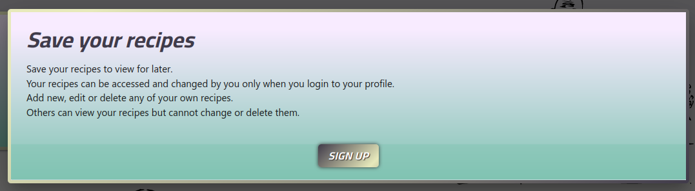 |
| Returning Site Users | |
| As a returning site user, I would like to be able to log in, so that I can access features available to signed up users. |  |
| As a returning site user, I would like to have a place to save my own recipes, so that I can retrieve them when I need to. |  |
| As a returning site user, I would like to have a place to save my recipes, so that I can share my creations with others. |  |
| As a returning site user, I would like to be able to view recipes by food type, so that I can find variations for a particular food type. |  |
| As a returning site user, I would like to be able to edit a recipe, so that I can adjust any changes I have made to my recipe. | 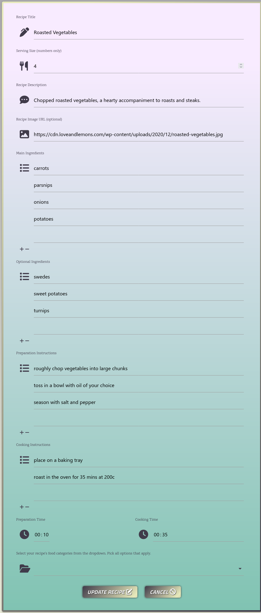 |
| Site Admin | |
| As a site administrator, I should be able to access the site, so that I can make changes to food categories. |  |
| As a site administrator, I should be able to access, so that I can create new food categories. |  |
| As a site administrator, I should be able to access the site, so that I can categorise recipes that have not been categorised by the owner, making them more easily accessible in searches. |  |
| As a site administrator, I should be able to access the site, so that I can delete fake entries (if created). |  |

## Bugs

The labels in the edit recipe form were overlapping the 1st prepopulated field until that field was clicked for editing.

 

- To fix this , I moved the label to outside of the input div.

Jinja2 `'Undefined Error'` while trying to set a delete button with a confirmation modal on my categories page I was getting this error saying that 'category' was not defined. I tried to fix at first by adding a jinja2 for loop to the modal but this resulted in multiple delete buttons as in image 2.

|   

- To fix this, I moved the modal structure inside of the jinja2 for loop and appended the modal id with the category id.

Werkzeug `Build error` could not build endpoint single_recipe with values [recipe_id].

|   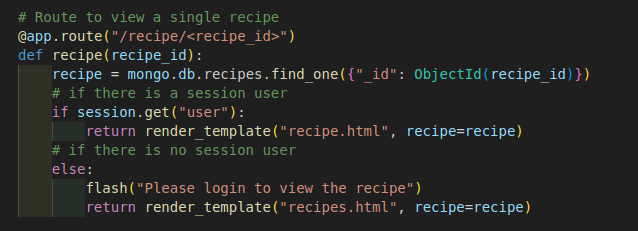

- To fix this, I renamed all 'single_recipe' entries to 'recipe' in the app routing along with the name of the recipe.html page.

The placeholders are too long for mobile screens.


- To fix this I shortened the legth of the placeholder text and made the size of the text samller using css.

## Unfixed Bugs

There are no more bugs that I am aware of.
